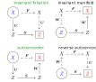

# Invariant Foliations, Manifolds and Autoencoders
* A Julia package to demonstrate various techniques for data oriented reduced order modelling

!!! warning
    This package and its documentation are experimental; there is still a lot of work to do. 
    The package is made available so that results in paper [^paper] can be reproduced.

This package collects various computational methods employed in paper [^paper]. 

The package also includes methods to calculate invariant foliations and invariant manifolds from low-dimensional vector fields as assymptotic polynomials.

We assume that the data is produced by an underlying map ``\boldsymbol{F}`` from vector space ``X`` to itself. Our data comes in pairs
```math
\left(\boldsymbol{y}_{k}, \boldsymbol{x}_{k}\right),\;k=1,\ldots,N,
```
where
```math
\boldsymbol{y}_{k}=\boldsymbol{F}\left(\boldsymbol{x}_{k}\right)+\boldsymbol{\xi}_{k}
```
and ``\boldsymbol{\xi}_{k}\in X`` is a small noise sampled from a distribution with zero mean. While the paper [^paper] assumes that ``\boldsymbol{F}\left(\boldsymbol{0}\right)=\boldsymbol{0}``, the package can handle data with a fixewd point not at the origin.

There are four ways to connect a low-order model ``\boldsymbol{S}`` to ``\boldsymbol{F}``. The figure below shows the four combinations. Only invariant foliations and invariant manifolds produce meaningful reduced order models. Only invariant foliations and autoencoders can be fitted to data. The intersection is the invariant foliation.



An invariant foliation is fitted to data by solving
```math
\arg\min_{\boldsymbol{S},\boldsymbol{U}}\sum_{k=1}^{N}\left\Vert \boldsymbol{x}_{k}\right\Vert ^{-2}\left\Vert \boldsymbol{S}\left(\boldsymbol{U}\left(\boldsymbol{x}_{k}\right)\right)-\boldsymbol{U}\left(\boldsymbol{y}_{k}\right)\right\Vert ^{2},
```
where ``\boldsymbol{U}`` is an encoder mapping from ``X`` to a lower dimensional space ``Z`` and ``\boldsymbol{S}:Z\to Z`` is a low-dimensional map.

An autoencoder is fitted to data by solving
```math
\arg\min_{\boldsymbol{S},\boldsymbol{U},\boldsymbol{W}}\sum_{k=1}^{N}\left\Vert \boldsymbol{x}_{k}\right\Vert ^{-2}\left\Vert \boldsymbol{W}\left(\boldsymbol{S}\left(\boldsymbol{U}\left(\boldsymbol{x}_{k}\right)\right)\right)-\boldsymbol{y}_{k}\right\Vert ^{2},
```
where ``\boldsymbol{U}:X\to Z`` is the encoder, ``\boldsymbol{W}:Z\to X`` is the decoder and ``\boldsymbol{S}:Z\to Z`` is a low-dimensional map.

[^paper]: R. Szalai, Data-driven reduced order models using invariant foliations, manifolds and auto-encoders, 2022, preprint
